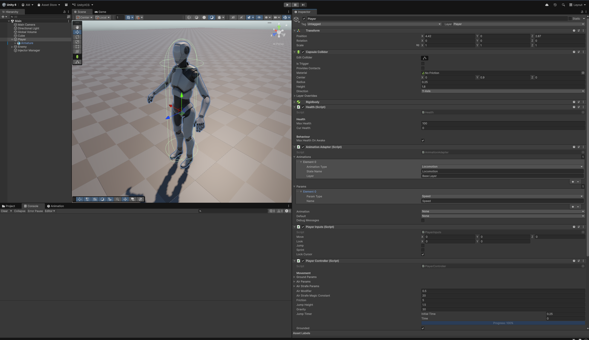
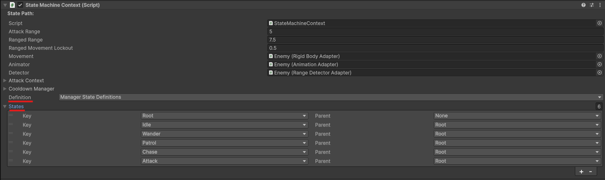
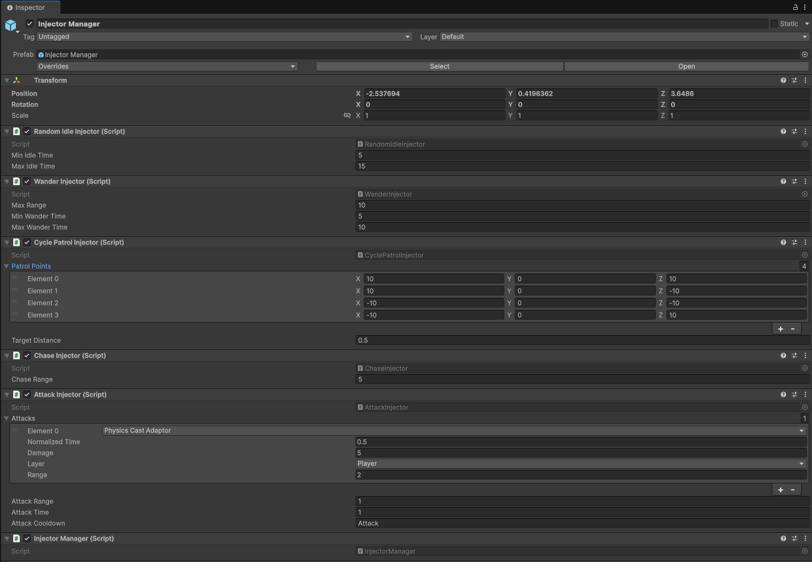
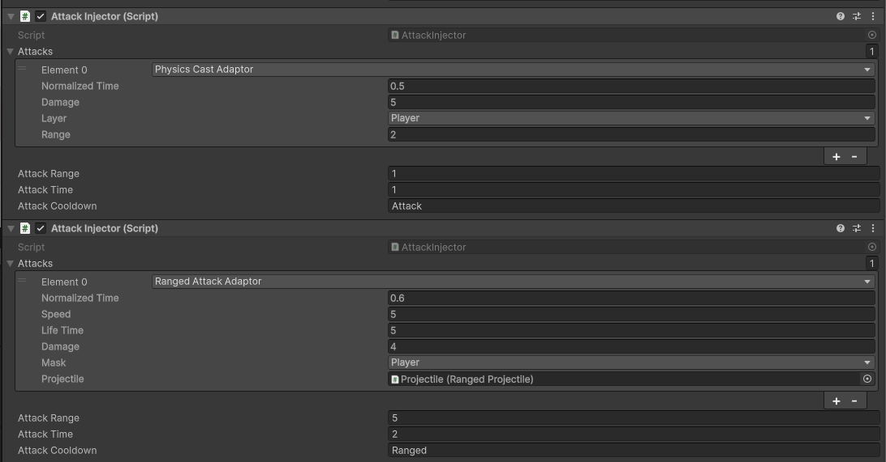
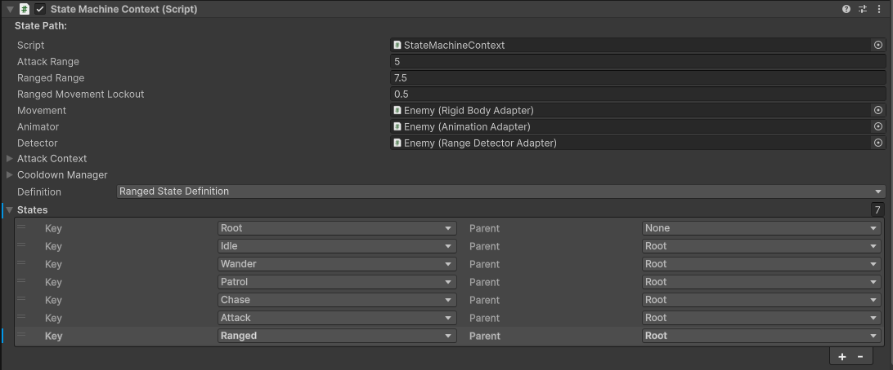

# Synoptic Project Evaluation

## State Machine
The core of the state machine handles updating and transitioning states including proper exit of states before entering the new state, finding the path to the new state and resolving the entering and exiting of states along the path. States contain basic methods like `OnUpdate()`, `OnEnter()` and `OnExit()` which can be implemented in custom state types, with the state machine calling the methods for it. Data flows in a couple of different ways:
 - Entity specific state data that does not need to accessed via anything other than the state and maybe an injector should stay in the state type
 - State data shared across multiple enemies like attack definitions and wander ranges are part of an injector that provides data to multiple entities
 - Entity specific data that multiple states reference is added to the `StateMachineContext` allowing it to be passed around between states

## State Machine Context
The state machine context is a large context object holding all core references states may need like movement or animation adaptors. It also contains all the states, transitions and any extra references the states may need like a user defined attack range. Most states take a reference in the constructor allowing states to do things like move the entity and control its animations. This should be extended with any reference an entity may need no matter the type, while seemingly wasteful, it was elected to go this route where a small amount of unique data will be wasted rather than have to store some inherited type and to a large amount of casting up and down.

## Transitions
Transitions are defined inside a class that provides a set of methods that are called upon initialisation of the state machine. The `IStateDefinition` interface provides methods like `InitInjectors` and `InitTransitions` providing the `StateMachineContext` for the states to be defined for. It also provides a method `InitFactory` for adding new custom states to the state factories and how they are constructed. Transitions are defined using a function that is evaluated to determine if the transition should happen, transitions can either be independent of the current state or specific to the current state. Some examples transition situations have below have been provided:
 - When health drops to 0: Here the state machine just needs to go to a dead state to stop any actions, this is not state specific and so it can be classified as an 'any' state transitions
 - When chasing a target and getting into attack range: Specific to the chase state and so is a state specific transition from the chasing to attacking

## Injectors
The final piece of the puzzle is to add injectors to supply states with relevant data, injectors provide data that would be shared across multiple entities - usually the same type but in some cases like patrol points or wander settings you may be able to share across all! This allows for configuring data in a central way and having the changes update for all entities using those injectors - it is very important to not store state specific data in these as other entities may access the injector. You may either want to store them on the entity for very specific cases or use some kind of manager/singleton to provide a way for entities to gain a reference to their injectors - this can be overriden in the `StateDefinition` implementation in the `InitInjectors` method.

# Template Project Walkthrough

## Player Setup:
The root player has a `PlayerInputs` component along with a `PlayerController` to handle movement with an underlying `Rigidbody` and `CapsuleCollider` providing a valid physics settings. It will also have a `Health` component allowing the player to be attacked by enemies. This is available as a prefab in the Assets/Prefabs folder for easy setup.

The hierarchy of the player is expected to look something like this - `GameObjects` are connected via the lines with the dashes under them respresenting components they have:
```
Root:
 │ - PlayerController
 │ - PlayerInputs
 │ - Rigidbody
 │ - CapsuleCollider
 │ - Health
 │ - AnimationAdapator
 │
 └── Model:
        - Animator
```



## Enemy Setup
Enemies are a little more complicated with a few extra components providing adaptors allowing functionality to be overriden. They have a `StateMachineContext` providing the state machine references and states, this must have it's states field configured with all desired states - make sure to configure these! The state machine also uses a state definition to allow the user to define its transitions conditions and add any custom states to the state factory which is used to build the state tree at runtime.



```
Root:
 │ - StateMachineContext
 │ - RangedDetectorAdaptor    (Detector)
 │ - RigidbodyMovementAdaptor (Movement)
 │ - AnimationAdaptor         (Animation)
 │ - Rigidbody
 │ - CapsuleCollider
 │ - Health
 │
 └── Model:
        - Animator
```

## Injector Setup
Injectors all sit on a single `InjectorManager` singleton that provides an easy way to supply entities with injector references, this would likely need to be extracted to provide per enemy type injectors but it simplifies setup for the example massively.



# Implementation Guide

## Custom Injector
To make entities patrol across all patrol points and spread themselves out over available nodes a new `DistributedPatrolInjector` was created to provide this behaviour. The class uses the same implementation as the `CyclePatrolInjector` with a store listing which entities have a certain patrol point allowing them to keep track of which point they are currently at. This was done by modifying the `GetStartIndex`, `Next` and `Prev` methods along with `OnEnter` and `OnExit` removing them from the store.

[Distributed Patrol Injector class]("./Assets/Examples/Custom%20Injectors/DistributingPatrolInjector.cs")

```cs
// _contextToPos: Dictionary<StateMachineContext, int> - Maps context to current patrol target index
// _currentPatrols: Patrol[] - Array of patrol values (index is patrol index) containing list of patrol members

///<summary>Get starting patrol point</summary>
///<param name="context">Entity context</param>
///<param name="index">Patrol index</param>
///<returns>New patrol index</returns>
public int GetStartIndex(StateMachineContext context, int index) {
    int newIndex = ++_nextPatrolIndex % _patrolPoints.Length;

    _contextToPos.Add(context, newIndex);
    _currentPatrols[newIndex].PatrolMembers.Add(context);

    return newIndex;
}

///<summary>Get next patrol index wrapped to patrol points length</summary>
///<param name="context">Entity context</param>
///<param name="index">Patrol index</param>
///<returns>Next patrol index</returns>
public int Next(StateMachineContext context, int index) {
    int newIndex = (index + 1) % _patrolPoints.Length;

    _currentPatrols[index].PatrolMembers.Remove(context);
    _currentPatrols[newIndex].PatrolMembers.Add(context);
    _contextToPos[context] = newIndex;

    return newIndex;
}
```

This then replaced the `CyclePatrolInjector` in the injector manager, meaning entities now use the new injector which manages their starting index to distribute them across the patrol points.

## Custom State
Implementing a state requires a lot more work than an injector as it interacts with a significantly larger number of systems. Data wise, the only difference is the attack data meaning a new attack adaptor can be implemented and then used with the existing `AttackInjector` implementation defining a second ranged version with different parameters - the injector manager needed a new ranged injector reference of type `AttackInjector`.
```cs
[DefaultExecutionOrder(-99)]
public class InjectorManager : Singleton<InjectorManager> {

    [SerializeField] public IIdleInjector Idle;
    [SerializeField] public IWanderInjector Wander;
    [SerializeField] public IPatrolInjector Patrol;
    [SerializeField] public IChaseInjector Chase;
    [SerializeField] public IAttackInjector Attack;
    [SerializeField] public IAttackInjector Ranged; // New ranged injector
}
```

A new attack adaptor handling ranged attacks was then added along with a very simple script to handle the velocity and collision of the spawned projectile. The adaptor contains a reference to the projectile to spawn along with some simple settings like speed, damage and lifetime, with the other parameters coming through the `AttackContext`.

```cs
[Serializable]
public class RangedAttackAdaptor : AttackAdaptor {

    [SerializeField] private RangedProjectile _projectile;
    [SerializeField] private LayerMask _mask;
    [SerializeField] private float _damage = 4.0f;
    [SerializeField] private float _lifeTime = 5.0f;
    [SerializeField] private float _speed = 5.0f;

    public override void OnEvent(AttackContext context) {
        UnityEngine.Object.Instantiate<RangedProjectile>(_projectile, context.Origin + context.Direction * 0.5f, Quaternion.identity)
            .Fire(context.Direction, _lifeTime, _speed, _damage, context.Entity.gameObject);
    }
}

public class RangedProjectile : MonoBehaviour {

    // Rest of class omitted but file is linked below...

    public void Fire(Vector3 direction, float lifeTime, float speed, float damage, LayerMask mask, GameObject owner = null) {
        transform.rotation = Quaternion.LookRotation(direction, Vector3.up);
        _owner = owner;
        InitRigidbody().linearVelocity = transform.forward * speed;
        _damage = damage;
        _lifeTime = lifeTime;
        _layer = mask;
    }

    private void FixedUpdate() {
        _lifeTime -= Time.fixedDeltaTime;

        if (_lifeTime <= 0) {
            Destroy(gameObject);
        }
    }

    private void OnTriggerEnter(Collider hit) {
        if (hit.gameObject != _owner && hit.TryGetComponent(out IDamageable damageable)) {
            damageable.Damage(new DamageSource(_damage, _owner, hit.gameObject));
            Destroy(gameObject);
        }
    }
}
```
[Ranged Projectile full class]("./Assets/Examples/Custom%20State/RangedProjectile.cs")



The first step towards implementing the state itself is to define a new state type inheriting the `State` class: 

```cs
[System.Serializable]
public class RangedState : State { /* Empty for now */ }
```

This state re-uses a significant amount of the base [Attack State](./Assets/Scripts/AI/States/Attack.cs) however it must use a different injector having the slight modification of being able to move once a large enough portion of the attack animation is complete to allow the enemy to attempt to close in on its target and eventually switch to melee attacks

[Ranged State]("./Assets/Examples/Custom%20State/RangedAttack.cs")
```cs
// RangedState::OnUpdate()
OnUpdate(float dt) {
    // { Attacking logic + queue drain... }

    if (normalizedAttackTime >= _context.RangedMovementLockout || !_isAttacking) {
        _context.Animator.Play(AIAnimationType.Locomotion);
        TryUpdateDestination();
    }
    _context.Animator.SetFloat(Adapters.AIAnimationParam.Speed, _context.Movement.NormalizedSpeed);
}
```

Now this just needs to be wired up, we need a new type of state in the `AIState` enum - this can be done using the `Assets/AI/Recreate State Enums` action or just adding to the base enum. The states in the `StateMachineContext` need to be added to with a new definition for ranged with the root state as its parent to ensurethe new state is created during initialisation. To do this, the state factory needs to be given a definition for the ranged state. This is done through a custom state definition:

```cs
public class RangedStateDefinition : IStateDefinition {
    public void InitFactory(StateFactory factory) {
        factory.AddStateDefinition(new StateFactoryDefinition(AIState.Ranged, StateCreators.CreateRanged));
    }

    public void InitInjectors(StateMachineContext ctx) {
        ctx.IdleInjector = InjectorManager.Instance.Idle;
        ctx.WanderInjector = InjectorManager.Instance.Wander;
        ctx.PatrolInjector = InjectorManager.Instance.Patrol;
        ctx.ChaseInjector = InjectorManager.Instance.Chase;
        ctx.AttackInjector = InjectorManager.Instance.Attack;
        ctx.RangedInjector = InjectorManager.Instance.Ranged;
        ctx.IdleInjector.ContextInit(ctx);
        ctx.WanderInjector.ContextInit(ctx);
        ctx.PatrolInjector.ContextInit(ctx);
        ctx.ChaseInjector.ContextInit(ctx);
        ctx.AttackInjector.ContextInit(ctx);
        ctx.RangedInjector.ContextInit(ctx);
    }

    public void InitTransitions(StateMachineContext ctx) {
        // Same transitions as ManagerStateDefinitions

        // New logic for different states based on distance from target
        ctx.StateMachine.AddStateTransition(
            ctx[AIState.Chase],
            ctx[AIState.Attack],
            new LambdaPredicate(() => ctx.ChaseInjector.InAttackRange(ctx, ctx.AttackInjector.AttackRange(ctx))));

        // Chase
        ctx.StateMachine.AddStateTransition(
            ctx[AIState.Chase],
            ctx[AIState.Ranged],
            new LambdaPredicate(() => ctx.ChaseInjector.InAttackRange(ctx, ctx.RangedInjector.AttackRange(ctx))));

        // Attack
        ctx.StateMachine.AddStateTransition(
            ctx[AIState.Attack],
            ctx[AIState.Chase],
            new LambdaPredicate(() => ctx.AttackInjector.UnableToAttack(ctx)));

        ctx.StateMachine.AddStateTransition(
            ctx[AIState.Attack],
            ctx[AIState.Ranged],
            new LambdaPredicate(() =>
                ctx.ChaseInjector.InAttackRange(ctx, ctx.RangedInjector.AttackRange(ctx)) &&
                !ctx.ChaseInjector.InAttackRange(ctx, ctx.AttackInjector.AttackRange(ctx))));

        // Ranged
        ctx.StateMachine.AddStateTransition(
            ctx[AIState.Ranged],
            ctx[AIState.Chase],
            new LambdaPredicate(() => ctx.RangedInjector.UnableToAttack(ctx)));

        ctx.StateMachine.AddStateTransition(
            ctx[AIState.Ranged],
            ctx[AIState.Attack],
            new LambdaPredicate(() => ctx.ChaseInjector.InAttackRange(ctx, ctx.AttackInjector.AttackRange(ctx))));

    }
}
```

